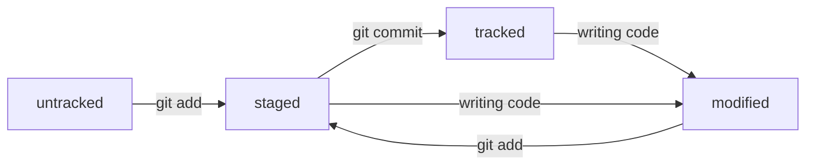

# Шпаргалка по GIT

## Настройка и просмотр конфигурации
```
git config --global user.name "Kot Kompot"               // Настройка данных пользователя
git config --global user.email kotkompot@yandex.ru
git config --list                                        // Просмотр конфигурации
```
```
ssh-keygen -t ed25519 -C "kotkompot@yandex.ru"           // Генерируем SSH-ключи
ssh-keygen -t rsa -b 4096 -C "kotkompot@yandex.ru"       // запасной алгоритм
```
## Начало работы с проектом
```
git init            // Инициализация папки как репозитория
git clone           // Клонировать удаленный репозиторий в пустую локальную папку
                    // Чтобы разгитить папку достаточно удалить подкаталог .git
README.md           // файл с описанием проекта
```
```
                    // Cвязать удаленный и локальный репозитории
git remote add origin git@github.com:%ИМЯ_АККАУНТА%/first-project.git

git remote -v       // Проверка привязки
```
## Подготовка файлов к коммиту
```
git status                   // проверить состояние
```



```
            СТАТУСЫ ФАЙЛОВ
tracked                      // отслеживается, не изменялся с последнего коммита
untracked                    // не отслеживается
staged                       // файл добавлен и подготовлен к коммиту
modified                     // файл изменен с последнего добавления
staged + modified            // файл добавлен, а потом изменен (staged неизмененная версия)
```
```
            STAGE / UNSTAGE
git add .                    // добавить все в текущей папке
git add --all                // добавить все файлы в репозитории
git add <file>               // добавить конкретный файл
git restore --staged <file>  // убрать добавление файла (unstage)
git restore --staged .       // Unstage все файлы
```
```
git restore <file>           // откатить modified файл
git diff                     // посмотреть разницу с предыдущей версией
git diff --staged            // включая staged файлы
```
## Коммиты и загрузки
```
git commit -m 'Commit description'         // закоммитить с комментом
git push -u origin master                  // Первая загрузка проекта в удаленный репозиторий
git push                                   // Любая последующая загрузка
Esc + :qa! + Enter                         // Выйти из гребаного Vim
```
```
                     ПРАВИЛА КОММЕНТОВ
feat:                                      // новая фича
fix:                                       // исправление ошибки
BREAKING CHANGE:                           // нарушается обратная совместимость!!!
LGS-239:                                   // тикет в джире
something with #123                        // тикет в гите
docs: style: refactor: perf: test:         // прочие
```
конвенциональные коммиты выглядят вот так:
```
<type>[optional scope]: <description>

[optional body]

[optional footer]
```
## Лог коммита: что внутри?
```
git log               // посмотреть лог коммитов
git log --oneline     // сжатый вид (1 строка на коммит)
```
```
       ПАРАМЕТРЫ КОММИТА
HEAD                  // последний коммит (можно использовать в коммандах вместо хеша)
Hashcode              // уникальный идентификатор коммита
Author + Date         // автор и дата
Description           // Сообщение к коммиту
```
```
git diff <HASH1> <HASH2>        // посмотреть разницу между коммитами
```
## Исправить сделанный коммит
```
git commit --amend --no-edit              // добавить изменения в последний коммит
git commit --amend -m "Новое сообщение"   // добавить изменения + новое сообщение
```

```
git reset --hard <commit hash>            // откатиться к указанному коммиту
```
## Ветки
```
git branch                                 // показать все ветки
git branch -a                              // включая те, что на сервере
git branch <ветка>                         // создать ветку
git checkout <ветка>                       // переключиться на другую ветку
git checkout -b <ветка>                    // создать и переключиться
```
```
git diff <ветка1> <ветка2>                 // сравнить ветки
git diff <ветка1> <хеш>                    // сравнить ветку и коммит
git diff HEAD~ HEAD                        // сравнить текущий и предыдущий коммиты
git diff feature/diff~2 feature/diff       // сравнить текущий и -2 коммиты в ветке
```
```
git merge <ветка>                          // слить ветку в текущую
```
